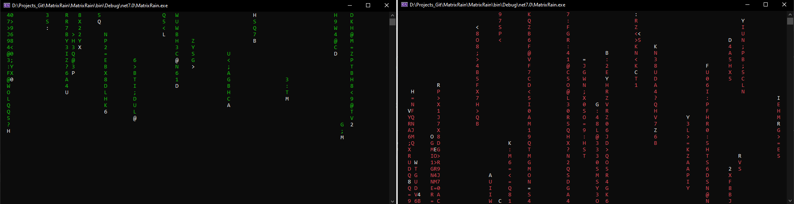

# MatrixRain #

Console's MatrixRain app, which displays falling code similar to the Matrix movie. The program can be run with 4 options:

--direction-up - specifies the direction whether the code will "fall" in the bottom-up direction ("reverse gravity").
The default value is false if the argument will not be used when the program is run - in that case the code will "fall" by default in the top-down direction (like normal rain due to
gravity).

--color - color of the rendered characters. The default value is green
color . All characters of the falling code will be rendered with this color, except
the first "falling" character, which will always be rendered in white 

--delay-speed - slows down the code rendering speed. Specifies the number

--color - color of the rendered characters. The default value is green
color . All characters of the falling code will be rendered with this color, except
the first "falling" character, which will always be rendered in white 

--delay-speed - slows down the code rendering speed in integer type. Specifies the number 
of milliseconds to wait for the next step of shifting characters and rendering codes to the console screen.
The default value is 1 and must not be negative.

--characters - specifies the set of characters from which falling code characters will be generated.
Possible values will be:
o Alpha - alphabetic (alpha) characters from 'A' to 'Z' will be generated,
o Numeric - numeric characters from '0' to '9' will be generated,
o AlphaNumeric - alphanumeric characters from '0' (zero) to 'Z' (the letter Z) will be generated.
The default value is AlphaNumeric.

In addition, one more option is available:
--help - will display a description of the program usage and possible options.

When the program is run, it will first clear the console screen and then begin to render the "matrix
rain" according to the following rules:
- The generation of the first initial characters will be on the first console line or on the last
line of the console according to the direction-up parameter.
- Characters are generated from the defined character set according to the characters parameter.
- Each generated code (falling characters) can be of different sizes, with a minimum number of
number of characters generated will be 2 and the maximum number of characters generated will be up to the size of the height of the
console screen size.
- During the falling, at each step, any already displayed code character can be randomly changed to
another.
- The color of all characters will be according to the color parameter except the first character, which will be rendered
in white.
- Characters are rendered in each step shifted one line position down or up according to
the direction-up parameter. The scrolling speed of all falling codes will be given by the slowdown
according to the delay-speed parameter.
- If the user presses any key, the program will terminate, while the colors will reset beforehand,
the console screen is cleared and the cursor is displayed so that the command line can be used as
before the program was started.

  
